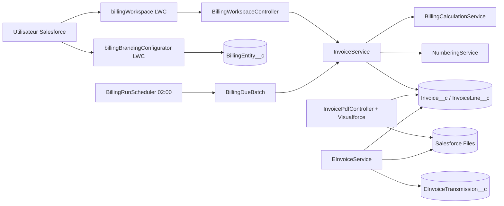
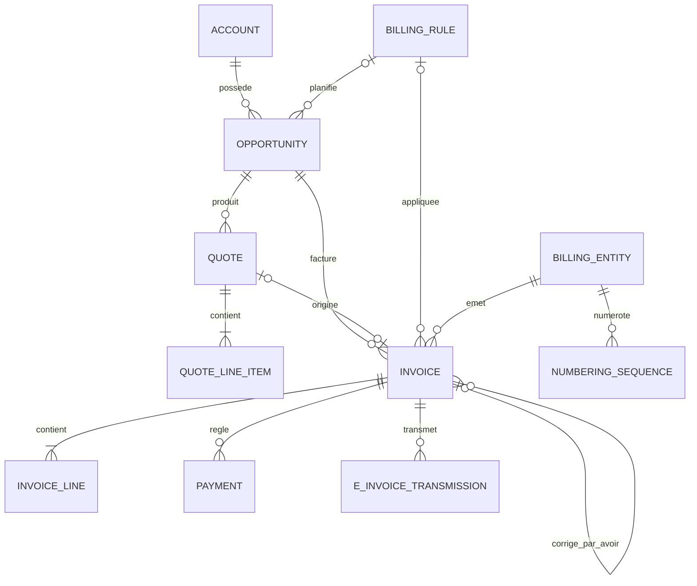

# Documentation technique — Facturation Salesforce

Version documentée : API Salesforce 65.0<br/>
Public : architectes, développeurs Salesforce, administrateurs et équipe d’exploitation.

État de référence : livraison du 5 juillet 2026, run de tests
`707KB000027XkfR` — 100 % de réussite et 83 % de couverture du périmètre projet.

## 1. Objectif et périmètre

L’application fournit un cycle de facturation natif dans Salesforce :

- création et suivi de devis avec les objets standards `Quote` et `QuoteLineItem` ;
- conversion idempotente d’un devis accepté en facture ;
- création d’une facture directement depuis les produits d’une opportunité ;
- facturation planifiée selon une règle ponctuelle ou récurrente ;
- calcul des montants HT, TVA, TTC, règlements et solde ;
- émission, numérotation et verrouillage des factures ;
- création d’avoirs complets ou partiels avec numérotation dédiée ;
- génération d’un PDF versionné dans Salesforce Files ;
- préparation et traçabilité de la facturation électronique.

Le module prépare les flux Chorus Pro ou Plateforme Agréée. Il n’envoie aucun
document externe tant que les credentials, contrats d’API et contrôles EN 16931
ne sont pas finalisés.

## 2. Vue d’architecture



Principes retenus :

- interface Lightning légère ; la logique métier reste dans les services Apex ;
- création transactionnelle de l’en-tête et des lignes ;
- données client figées sur la facture pour préserver l’historique ;
- numérotation uniquement au moment de l’émission ;
- immutabilité après émission ;
- traitements planifiés idempotents ;
- configuration métier par données, sans modification de code.

## 3. Modèle de données



### Objets principaux

| Objet | Rôle | Points importants |
|---|---|---|
| `Opportunity` | Source commerciale | Produits, règle, prochaine date et état de planification |
| `Quote` / `QuoteLineItem` | Devis standard | TVA et données de routage ajoutées par champs personnalisés |
| `Invoice__c` | Facture ou avoir | Snapshot client, origine, période, facture corrigée, montants, verrouillage |
| `InvoiceLine__c` | Ligne de facture | Quantité, prix, remise, TVA et montants calculés |
| `BillingRule__c` | Règle de facturation | Fréquence, terme, frontière, jour, délai et émission automatique |
| `BillingEntity__c` | Émetteur juridique | Identité, logo, couleur, paiement et mentions légales |
| `NumberingSequence__c` | Séquence annuelle | Préfixe, prochaine valeur et padding par entité |
| `TaxRate__c` | Référentiel TVA | Taux actif et taux par défaut |
| `Payment__c` | Encaissement | Montant, date, mode et référence |
| `EInvoiceTransmission__c` | Journal e-facture | Fournisseur, statut, fichier, référence et erreurs |

### Origine d’une facture

`Invoice__c.Origin__c` distingue :

- `Quote` : conversion d’un devis accepté ;
- `Direct` : création manuelle depuis l’opportunité ;
- `Scheduled` : création par le moteur planifié ;
- `CreditNote` : avoir créé depuis une facture émise.

`SourceQuote__c` reste nul pour les factures directes et planifiées.

## 4. Composants applicatifs

### Interface Lightning

`billingWorkspace` est placé sur une page Opportunité. Il fournit :

- indicateurs de devis, factures et solde ;
- recherche, navigation et actions contextualisées ;
- création d’un devis ou d’une facture directe ;
- conversion, émission, PDF et préparation e-facture ;
- configuration de la règle et de la prochaine date ;
- rafraîchissement après chaque mutation ;
- restitution des erreurs Apex réelles dans le toast et le bandeau.

`billingBrandingConfigurator` est exposé par l’action rapide
`BillingEntity__c.Configurer_PDF`. Il contrôle le logo Salesforce Files, la
couleur hexadécimale et les mentions du document.

### Services Apex

| Classe | Responsabilité |
|---|---|
| `BillingWorkspaceController` | Façade LWC et traduction des erreurs métier |
| `InvoiceService` | Conversion, création directe, avoir, émission et verrouillage |
| `InvoiceValidationService` | Contrôles juridiques et métier avant numérotation |
| `BillingSecurity` | Contrôles CRUD/FLS aux frontières Lightning |
| `BillingCalculationService` | Calcul déterministe des lignes et totaux |
| `BillingRuleEngine` | Périodes à échoir/échues et prochaine échéance |
| `BillingRunScheduler` | Déclenchement quotidien du batch |
| `BillingDueBatch` | Traitement par petits lots et journalisation par opportunité |
| `NumberingService` | Attribution atomique du prochain numéro |
| `InvoicePdfController` | Chargement, formatage et versionnement du PDF |
| `EInvoiceService` | Préparation du fichier et de la transmission électronique |
| `BillingBrandingController` | Validation et sauvegarde de l’identité visuelle |

## 5. Parcours métier

### Devis vers facture

1. L’utilisateur crée un devis depuis les produits de l’opportunité.
2. Les lignes, prix, remises et TVA sont copiés.
3. Le devis doit être au statut `Accepted`.
4. `InvoiceService.convertQuote()` recherche d’abord une facture existante pour
   le même devis.
5. Une facture brouillon et ses lignes sont créées dans la même transaction.

La recherche préalable sur `SourceQuote__c` rend la conversion rejouable sans
créer une seconde facture.

### Facture directe

1. Le bouton **Facture directe** appelle `createDirectFromOpportunity()`.
2. Le compte, l’entité par défaut et au moins un produit sont obligatoires.
3. La règle affectée est appliquée si elle existe ; sinon les conditions de
   l’entité de facturation sont utilisées.
4. Les données client et les lignes sont copiées dans une facture `Draft`.
5. La facture peut être contrôlée avant émission.

### Émission et PDF

L’émission verrouille la facture et attribue un numéro de la forme
`PREFIXE-ANNEE-NUMERO`. Le service utilise une lecture `FOR UPDATE` de la
séquence pour éviter deux numéros identiques en concurrence.

Une facture émise devient immuable. Le PDF est donc généré après émission. Une
nouvelle génération crée une nouvelle `ContentVersion` dans le même
`ContentDocument`, ce qui conserve l’historique sans multiplier les fichiers.

### Avoir complet ou partiel

1. **Créer un avoir** est disponible uniquement sur une facture émise dont un
   montant reste créditable.
2. Le brouillon reprend le snapshot client et les lignes de la facture d’origine.
3. L’utilisateur peut réduire ou supprimer les lignes avant émission pour un
   avoir partiel et renseigne le motif.
4. L’émission verrouille simultanément l’avoir et la facture d’origine, contrôle
   le montant restant, puis attribue un numéro de la séquence `CreditNote`.
5. Le montant crédité, le solde et le statut de la facture d’origine sont mis à
   jour. Le document émis d’origine reste immuable.

Le PDF d’un avoir porte le titre **AVOIR**, le numéro de facture corrigée, le
motif et le montant porté au crédit du client.

### Facturation planifiée

La tâche `Facturation quotidienne` exécute `BillingDueBatch` à 02:00. Seules les
opportunités répondant aux critères suivants sont sélectionnées :

- planification active ;
- règle affectée et active ;
- prochaine date inférieure ou égale à la date du traitement.

La clé unique `OpportunityId:BillingDate`, stockée dans
`Invoice__c.GenerationKey__c`, garantit l’idempotence. Après succès, la prochaine
date est calculée. Une règle ponctuelle désactive automatiquement la
planification. En cas d’erreur, le message est stocké dans
`Opportunity.LastBillingError__c` et les autres opportunités continuent.

### Calcul des périodes

Les fréquences disponibles sont ponctuelle, mensuelle, trimestrielle,
semestrielle et annuelle. Deux logiques sont combinables :

- `Advance` : la facture couvre la période qui commence à la date de facturation ;
- `Arrears` : elle couvre la période qui vient de se terminer ;
- `Calendar` : alignement sur les mois ou trimestres civils ;
- `Anniversary` : alignement sur la date anniversaire.

## 6. Transactions, contrôles et erreurs

- Les lignes recalculent leur montant avant sauvegarde.
- Les triggers agrègent les totaux sur la facture par traitement groupé.
- Un devis vide, une opportunité sans compte ou sans produit sont refusés.
- Une règle inactive ne peut pas être appliquée.
- L’activation d’une planification exige une règle et une prochaine date.
- Une facture sans ligne ne peut pas être émise.
- Avant numérotation, l’émetteur, le client, les mentions de paiement, la date de
  prestation et chaque ligne sont validés par `InvoiceValidationService`.
- Un avoir doit référencer une facture émise et ne peut pas dépasser le montant
  restant à créditer.
- Un paiement ne peut pas être enregistré sur un avoir.
- Les erreurs DML détaillées sont remontées jusqu’au toast Lightning.
- Le batch utilise une taille de 5 pour rester sous les limites de requêtes tout
  en isolant les erreurs métier.

## 7. Sécurité

- Toutes les classes de façade et de service sont déclarées `with sharing`.
- Les méthodes exposées au LWC vérifient les droits CRUD nécessaires ; les
  lectures renvoyées à l’interface vérifient aussi les champs essentiels.
- `Facturation_Admin` fournit les droits objets, champs, classes, page et onglets.
- Les secrets Salesforce CLI ne doivent jamais être versionnés ; `.sf`, `.sfdx`,
  fichiers d’authentification et clés sont exclus par `.gitignore`.
- Le workflow GitHub lit `SFDX_AUTH_URL` depuis un GitHub Environment protégé.
- Les organisations avec une tâche planifiée doivent autoriser explicitement les
  déploiements avec jobs Apex actifs dans **Deployment Settings** ; le workflow
  ne désactive jamais silencieusement la facturation.
- Aucun credential Chorus Pro n’est stocké dans le dépôt.
- Les services internes exécutés aussi par le batch utilisent un modèle de
  champs contrôlé par le code ; toute nouvelle méthode `@AuraEnabled` doit passer
  par la même façade de sécurité.

## 8. Facturation électronique

`EInvoiceService.prepare()` sélectionne actuellement :

- `ChorusPro` pour un destinataire public ;
- `AccreditedPlatform` pour un destinataire privé.

Il génère le PDF, crée une transmission `Prepared` et conserve la référence du
fichier. Le dépôt externe reste volontairement désactivé. Les écarts techniques
du connecteur déjà présent dans l’organisation sont détaillés dans
[chorus-pro-audit.md](chorus-pro-audit.md).

Avant activation réelle, il faut valider : OAuth/PISTE, routes contractuelles,
SIRET juridiques, XML EN 16931, profil Factur-X, PDF/A-3 et règles de reprise.

Le calendrier officiel impose la capacité de réception à toutes les entreprises
au 1er septembre 2026. À cette date, les grandes entreprises et ETI doivent aussi
émettre ; cette obligation d’émission s’applique aux PME et micro-entreprises au
1er septembre 2027. Un PDF ordinaire transmis par e-mail n’est pas une facture
électronique conforme au sens de la réforme.

Références : [calendrier du ministère de l’Économie](https://www.economie.gouv.fr/tout-savoir-sur-la-facturation-electronique-pour-les-entreprises),
[plateformes agréées — impots.gouv.fr](https://www.impots.gouv.fr/facturation-electronique-et-plateformes-agreees) et
[évolutions Chorus Pro 2026](https://portail.chorus-pro.gouv.fr/aife_documentation?id=kb_article_view&sysparm_article=KB0012631).

## 9. Tests

Les tests couvrent notamment :

- calculs HT/TVA/TTC ;
- conversion idempotente d’un devis ;
- facture directe sans devis ;
- règles à échoir et à terme échu ;
- batch de génération planifiée ;
- émission, numérotation et immutabilité ;
- validation pré-émission avec message exploitable ;
- avoir complet, avoir partiel et recalcul du solde ;
- encaissement et mise à jour du solde ;
- génération/versionnement PDF ;
- routage e-facture privé et public ;
- configuration du logo et de la couleur ;
- rafraîchissement du workspace et valeur destinataire par défaut.

Commande ciblée :

```bash
sf apex run test \
  --tests BillingCalculationServiceTest \
  --tests BillingBrandingControllerTest \
  --tests BillingSecurityTest \
  --tests BillingRuleEngineTest \
  --tests BillingRunSchedulerTest \
  --tests BillingWorkspaceControllerTest \
  --tests InvoiceServiceTest \
  --wait 30
```

## 10. Exploitation et supervision

Contrôles quotidiens recommandés :

1. tâches planifiées et batchs en erreur dans **Setup > Apex Jobs** ;
2. opportunités dont `LastBillingError__c` n’est pas vide ;
3. factures brouillon anciennes ;
4. séquences facture et avoir disponibles pour l’année courante ;
5. transmissions électroniques en échec ou bloquées ;
6. complétude juridique de l’entité de facturation.

Au changement d’année, créer les séquences `Invoice` et `CreditNote` par entité
avant la première émission. Après modification du logo ou des mentions, régénérer le PDF
des factures concernées uniquement si la politique comptable l’autorise.

## 11. Limites connues et évolutions

- Une règle facture actuellement l’ensemble des produits de l’opportunité à
  chaque période ; un futur modèle de contrat permettra des dates et quantités
  différentes par ligne.
- La relance client, le prélèvement, l’allocation multi-paiements et la
  reconnaissance de revenu ne sont pas inclus.
- Le PDF repose sur le moteur Visualforce historique, fiable pour l’impression
  mais limité en typographie et CSS avancé.
- Le raccordement Chorus Pro/Plateforme Agréée nécessite une phase projet dédiée.

Ces limites maintiennent un périmètre simple et maîtrisé, tout en laissant une
évolution possible vers un modèle plus proche de Revenue Cloud.
