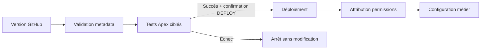

# Guide de déploiement

## 1. Stratégie

Le dépôt impose une validation Salesforce avant toute écriture :



Le workflow n’est jamais déclenché automatiquement par un push. Un utilisateur
autorisé doit le lancer manuellement et saisir `DEPLOY` pour permettre l’écriture.

## 2. Lien GitHub

[Ouvrir la validation et le déploiement GitHub](https://github.com/Nounem/Facturation/actions/workflows/deploy.yml)

Le bouton du README pointe vers ce même workflow. La valeur `VALIDATE` exécute
uniquement une simulation. La valeur exacte `DEPLOY` autorise le second job après
la réussite de la validation.

## 3. Prérequis Salesforce

- organisation Enterprise, Unlimited ou Developer compatible API 65.0 ;
- fonctionnalité Quotes activée ;
- utilisateur de déploiement autorisé à modifier les métadonnées ;
- Salesforce CLI pour un déploiement local ;
- entité juridique, taux de TVA et séquence de numérotation préparés.

### Prérequis pour une organisation déjà utilisée

La tâche quotidienne référence les classes Apex du projet. Par défaut,
Salesforce bloque alors leur redéploiement. Dans l’organisation cible :

1. ouvrir **Setup > Deployment Settings** ;
2. activer **Allow deployments of components when corresponding Apex jobs are
   pending or in progress** ;
3. enregistrer ;
4. après chaque livraison, vérifier la tâche dans **Scheduled Jobs** et les
   traitements dans **Apex Jobs**.

Cette option s’applique aux déploiements Metadata API. Salesforce avertit qu’une
modification incompatible peut faire échouer une tâche déjà planifiée : la revue
des changements du scheduler reste donc obligatoire.

## 4. Configuration GitHub

Créer deux GitHub Environments : `sandbox` et `production`.

Dans chaque environnement, ajouter le secret `SFDX_AUTH_URL`. La valeur est
obtenue localement pour un utilisateur technique dédié :

```bash
sf org display --target-org mon-alias --verbose
```

Copier uniquement la valeur `Sfdx Auth Url`. Ne jamais l’ajouter à un fichier du
dépôt. Pour `production`, activer des reviewers obligatoires dans la protection
de l’environnement GitHub.

## 5. Validation seule

1. Ouvrir le [workflow GitHub](https://github.com/Nounem/Facturation/actions/workflows/deploy.yml).
2. Cliquer **Run workflow**.
3. Choisir `sandbox` ou `production`.
4. Laisser `confirmation` à `VALIDATE`.
5. Laisser l’initialisation désactivée.
6. Contrôler le résultat de la validation et des tests.

Aucune métadonnée n’est écrite dans cette phase.

Si la validation signale `Apex jobs pending or in progress`, appliquer le
prérequis **Deployment Settings** ci-dessus. Le workflow ne suspend jamais une
tâche de facturation pour contourner ce contrôle.

## 6. Déploiement

Après validation et revue :

1. relancer le workflow sur le même commit ;
2. choisir l’environnement cible ;
3. saisir exactement `DEPLOY` ;
4. ne cocher l’initialisation que pour une organisation vide de démonstration ;
5. approuver l’environnement `production` si GitHub le demande ;
6. conserver l’URL et l’identifiant du job GitHub dans le ticket de livraison.

L’initialisation crée des valeurs de démonstration `À CONFIGURER`. Elle ne doit
pas être utilisée telle quelle en production.

## 7. Déploiement local équivalent

```bash
sf org login web --alias facturation-cible

sf project deploy validate \
  --source-dir force-app \
  --target-org facturation-cible \
  --test-level RunSpecifiedTests \
  --tests BillingCalculationServiceTest \
  --tests BillingBrandingControllerTest \
  --tests BillingRuleEngineTest \
  --tests BillingRunSchedulerTest \
  --tests BillingWorkspaceControllerTest \
  --tests InvoiceServiceTest \
  --wait 60

sf project deploy start \
  --source-dir force-app \
  --target-org facturation-cible \
  --test-level RunSpecifiedTests \
  --tests BillingCalculationServiceTest \
  --tests BillingBrandingControllerTest \
  --tests BillingRuleEngineTest \
  --tests BillingRunSchedulerTest \
  --tests BillingWorkspaceControllerTest \
  --tests InvoiceServiceTest \
  --wait 60

sf org assign permset \
  --name Facturation_Admin \
  --target-org facturation-cible
```

## 8. Configuration post-déploiement

1. Vérifier l’application **Facturation** et ses onglets.
2. Créer ou corriger l’entité de facturation : raison sociale, adresse, SIREN,
   SIRET, TVA, forme juridique, capital, RCS, email et instructions de paiement.
3. Charger le logo et choisir la couleur depuis **Configurer le PDF**.
4. Créer le taux de TVA par défaut.
5. Créer une séquence de facture pour l’année courante.
6. Créer les règles nécessaires ou exécuter `configureBillingRules.apex`.
7. Ajouter **Espace devis et factures** à la page Lightning Opportunité.
8. Vérifier la tâche `Facturation quotidienne` dans **Scheduled Jobs**.
9. Faire une recette avec un compte, une opportunité et un produit de test.

## 9. Recette minimale

| Test | Résultat attendu |
|---|---|
| Créer un devis | Devis et lignes visibles sans actualisation manuelle |
| Facturer un devis accepté | Une seule facture même après double clic/rejeu |
| Créer une facture directe | Facture brouillon sans `SourceQuote__c` |
| Émettre | Numéro définitif, statut émis et verrouillage |
| Générer le PDF | Fichier PDF ouvert et nouvelle version créée |
| Enregistrer un paiement | Solde et statut recalculés |
| Activer une règle sans date | Message de validation explicite |
| Exécuter le batch | Une facture par opportunité et échéance |

## 10. Retour arrière

Salesforce Metadata API ne fournit pas un rollback fonctionnel après un
déploiement réussi. La procédure est donc :

1. identifier le commit Git précédent ;
2. créer un commit de réversion revu par l’équipe ;
3. lancer `VALIDATE` sur la réversion ;
4. déployer la réversion ;
5. ne jamais supprimer automatiquement les factures déjà émises ;
6. traiter les corrections comptables par avoir ou procédure métier approuvée.

Les données de configuration et les documents créés après livraison doivent être
sauvegardés séparément des métadonnées Git.
